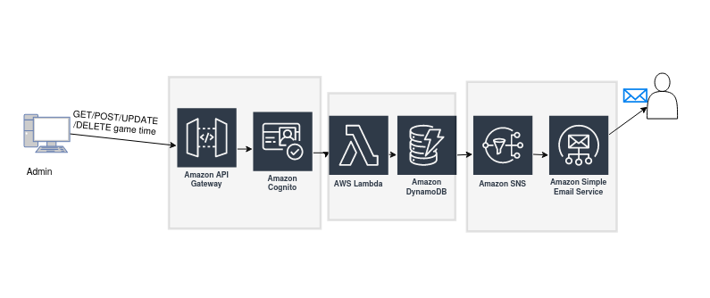

# Live telecast streams

**Live Telecast Streams** is an notification service which creates dynamoDB table for every program , there is at least two values

1. start_time
2. end_time

The values of these two entries can be like this

1. start_time = 27 October 2020, 11:34AM
2. end_time = 27 October 2020, 01:25 PM

Now the system sends 2 messages to a particular SNS when

* start_time === now
* end_time === now

That is whenever the particular time of the day is equal to any of the entries start_time or end_time then it will send 2 messages to a particular SNS.

## Table of Contents

* [Architecture diagram](#architecture-diagram)
* [How it works](#how-it-works)
* [Prerequisites](#prerequisites)
* [Running project](#running-project)
* [Testing](#testing)
* [API service](#api-service)
* [References](#references)
* [License](#license)
* [Contact](#contact)

## Architecture diagram

## How it works

## Prerequisites

## Running project

## Testing

## API service

## References

## License

## Contact
