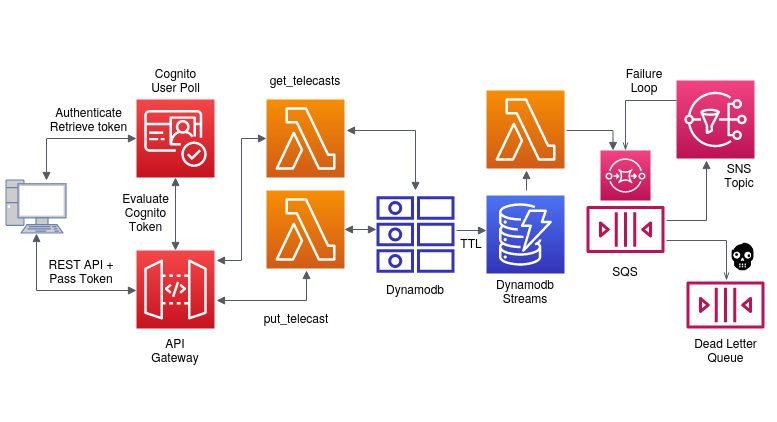

# Live telecast streams

**Live Telecast Streams** is an notification service which creates dynamoDB table for every program , there is at least two values

1. start_time
2. end_time

The values of these two entries can be like this

1. start_time = 27 October 2020, 11:34AM
2. end_time = 27 October 2020, 01:25 PM

Now the system sends 2 messages to a particular SNS when

* start_time === now
* end_time === now

That is whenever the particular time of the day is equal to any of the entries start_time or end_time then it will send 2 messages to a particular SNS.

## Table of Contents

* [Architecture diagram](#architecture-diagram)
* [How it works](#how-it-works)
* [Prerequisites](#prerequisites)
* [Running project](#running-project)
* [Testing](#testing)
* [API service](#api-service)
* [References](#references)
* [License](#license)
* [Contact](#contact)

## Architecture diagram



## How it works

#### Rest API

#### Data storing

#### Data streaming

#### Notification service

#### Infrastructure as Code

Although this section can be seen as unnecessary to the actual solution of the problem,  I decided to leverage the IasC solutions, which codifies the entire architecture and can save a ton of deployment time. There are several tools for managing serverless application, such as AWS SAM, serverless framework, and terraform. However, for the sake of minimality, I will decide between SAM and serverless framework.

 On the one hand, the serverless framework is a provider-agnostic solution. Thus, its possible to deploy FaaS functions into multiple serverless vendors. Interestingly, the Deployment process is magical (Creates s3 buckets to store artefacts automatically) in SF, and indeed, it's easy. Offline testing needs to install an extra package(serverless offline) and does not need a docker.

 On the other hand, as SAM is an abstract layer of AWS cloudformation, it is easy for running AWS user. Moreover, it consists of fewer boilerplate.SAM Local creates the same environment as Lambda, which spins up local API gateway and then runs function in docker. Finally, it has deep integration of AWS tools for debugging , testing and development such as  AWS Serverless Application Repository, AWS Toolkit for Visual Studio Code, AWS Cloud9 IDE, Jenkins plugin.

 Considering the above options with my solution, I decided to stick with SAM:
1. Owing to this solution is utterly based on AWS, it will be overkill to use a multi-cloud solution tool.
2. Development and testing with the more AWS like tools with SAM may ease the process.
3. Local development will be more likely to AWS Lambda.  


## Prerequisites
Software required to run the project. Install:
- [AWS CLI](https://docs.aws.amazon.com/cli/index.html)
- [SAM CLI](https://docs.aws.amazon.com/serverless-application-model/latest/developerguide/serverless-sam-cli-install-linux.html)
- [Python 3.8+ (pip)](https://www.python.org/)
- [Docker](https://docs.docker.com/get-docker/)

## Running project

Script `manage.sh` works as a managing tool.

- install project prerequisites
```sh
./manage.sh newb
```

- start testing locally
```sh
./manage.sh test
```

## Testing

## API service

## References
Inspired by following codes, articles and videos:
* [Infrastructure as Code: What Is It? Why Is It Important?](https://www.hashicorp.com/resources/what-is-infrastructure-as-code)
* [Comparing AWS SAM with the Serverless framework](https://sanderknape.com/2018/02/comparing-aws-sam-with-serverless-framework/)
* [Serverless comparisons](https://www.serverless.com/learn/comparisons/)

## License

## Contact
